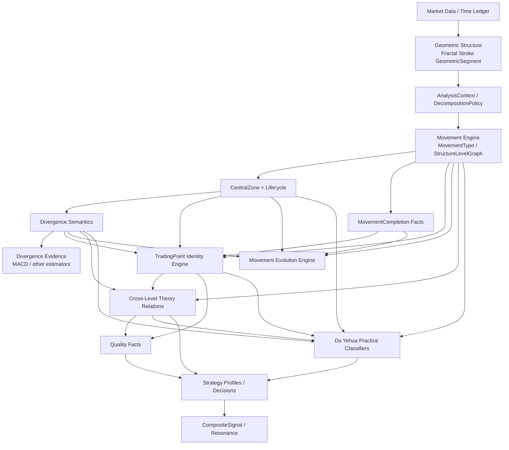

# 缠论分析引擎终局架构与理论边界

> 状态：Target Architecture / 长期基线候选  
> 日期：2026-08-08  
> 目的：定义项目长期理论本体、工程边界、证据模型与分阶段开发顺序。  
> 重要：本文不是当前已实现功能清单。除明确标记为当前阶段的内容外，其余能力只做架构预留，不应一次性开发。

---

## 1. 终局原则

本项目长期遵守以下原则，这些原则优先于历史实现：

1. **Market Interval、Analysis Context、Operation Level、Chan Structure Level 必须分离。**1m/5m/30m 首先是数据采样/观察周期，不能永久等同于理论级别。
2. **严格递归与固定级别实用分析都要支持，但必须记录构造方式。**原著允许从最低级别逐级递归，也明确允许为了实际操作采用固定级别的简化分析；两者不能混成同一种 provenance。
3. **GeometricSegment 不等于次级别 MovementType。**只有已经完成的次级别走势类型，才可以在更高级别观察中被抽象为“无内部结构的线段”；不能反过来把任意几何线段自动升级为次级别走势类型。
4. **Canonical Central Zone 的组成单位是完成的次级别走势类型，不是任意几何 Segment。**当前 `SegmentCentralZone` 只能视为项目级单层近似对象，不能直接作为终局 canonical 中枢本体。
5. **走势结构、背驰语义、走势完成/演化、买卖点身份是并列消费共同事实的不同引擎。**禁止建立 `TerminationMode -> B1/B2/B3` 的单向父子关系。
6. **TradingPoint Identity、Quality Facts、Strategy Decision 三层隔离。**配置不能改变已经成立的理论身份。
7. **身份所需的跨级别证据和策略额外要求的跨级别证据必须分开。**例如严格 B2 的直接次级别 B1 构成关系属于 IdentityEvidence，不是“更强 B2”的可选质量项。
8. **MACD 是背驰证据/估计方法，不是原著背驰语义本身。**任何指标证据都不能被永久写成理论身份的唯一 hard gate。
9. **区间套、买点构成、极值承载、重合、共振是不同关系。**禁止统称为一个 `recursive_confirmation`。
10. **都业华“四种终结模式”、强弱、类二买、分型重构等属于 Practice Layer。**除非能直接核验课程原话，不得伪装成缠中说禅原著枚举或定理。
11. **共振和大小周期组合属于上层派生信号。**不建立“市场转折事件”作为底层 canonical 实体。
12. **终局架构可以一次设计清楚，实现必须分阶段。**前一层没有通过真实行情、无未来函数、前缀一致性和审计验证，不进入下一层。

---

## 2. 理论来源分层

所有关键规则必须能追溯到以下三类来源之一。

### 2.1 `ORIGINAL_THEORY`

缠中说禅原著/定理，用于定义：

- 走势终完美；
- 中枢、盘整、趋势；
- 走势类型连接与分解；
- 级别的递归定义；
- 中枢延伸、扩展、新生；
- 背驰与盘整背驰；
- 三类买卖点及其完备性；
- 第二类买卖点由直接次级别第一类买卖点构成；
- 第三类买卖点；
- 买卖点级别关系；
- 区间套；
- 背驰后的级别与走势演化；
- 小级别背驰引发更大级别转折的理论关系；
- 同级别分解、多义性与结合律。

### 2.2 `DU_YEHUA_PRACTICE`

都业华课程实践体系，用于定义或候选定义：

- 四种终结模式；
- B1/B2/B3 强弱；
- R 比率；
- 分型停顿；
- 类二买；
- 分型重构买点；
- 区间套的实战使用；
- 大小周期组合；
- 黄金分割等辅助工具。

公开资料中存在大量二手笔记，因此：

- 课程目录可以确认课程主题；
- 二手笔记只能形成候选规则；
- 精确阈值、等号边界、强弱算法落地前应尽量回看课程视频；
- 未核验细节标记为 `DU_YEHUA_PRACTICE_UNVERIFIED_DETAIL`。

### 2.3 `PROJECT_POLICY`

软件化必须明确、但原著没有用工程规范描述的问题，例如：

- 候选/正式生命周期；
- `confirmed_at`；
- 无未来函数；
- 数据身份与 fingerprint；
- 分析上下文 ID；
- 规则版本；
- 单层近似模式；
- `IdentityStatus / StrategyDecision`；
- 审计证据。

---

## 3. 核心本体：先定义“什么东西是什么”

### 3.1 `MarketInterval`

表示市场数据采样周期，例如：

```text
1m / 5m / 30m / 1h / 1d
```

它回答：

> 数据是按什么时间粒度采样的？

它**不直接回答**理论上的结构级别是什么。

### 3.2 `AnalysisContext`

表示一次分析采用的完整观察上下文，至少包含：

- `analysis_context_id`；
- `market_interval`；
- `decomposition_policy_id`；
- `construction_method`；
- `operation_level_ref`；
- 数据起止范围；
- `as_of` / `confirmed_at`；
- `rule_version`。

同一段行情允许在不同 `AnalysisContext` 下存在不同但合法的结构解释。

### 3.3 `DecompositionPolicy`

走势连接有结合性和多义性；固定同级别分解可以获得唯一分解。

因此程序必须显式知道当前使用什么分解规则，例如：

```text
SAME_LEVEL_DECOMPOSITION
CENTER_DRIVEN_DECOMPOSITION
MIXED_OPERATIONAL_DECOMPOSITION
```

Phase 早期只实现一个经过严格验证的固定规则也可以，但不能把“当前唯一实现”误认为“理论唯一解释”。

### 3.4 `ConstructionMethod`

终局至少支持三种语义来源：

#### `STRICT_RECURSIVE`

从选定最低不可分级别开始：

```text
低级别走势类型
-> 三个以上连续低级别走势类型重叠形成高一级中枢
-> 高一级盘整/趋势
-> 继续向上递归
```

这是原著最严格的递归定义。

#### `FIXED_LEVEL_OPERATIONAL`

按选定操作/观察级别进行实用分析，把**已经完成的次级别走势类型**在高级别观察中视为无内部结构的线段式单元。

原著明确认为这种用法虽然“不大严格”，但实际操作没有原则性问题。

#### `SEGMENT_APPROXIMATION`

当前项目为了先跑通单级别闭环，直接使用 `GeometricSegment -> SegmentCentralZone -> TradingPoint`。

这是 `PROJECT_POLICY` 的工程近似，不等价于：

```text
GeometricSegment == completed direct-sublevel MovementType
```

所有由此生成的买卖点必须保留该 provenance，不能将其静默升级成 `STRICT_RECURSIVE` 结果。

### 3.5 `OperationLevel`

表示策略选择“按哪个级别操作”。

原著明确指出，走势是客观的，而选择用什么级别分析/操作具有主观性。

因此：

```text
MarketInterval != OperationLevel != StructureLevelRef
```

三者可能在某种实用分析中名称看起来相同，但领域模型不得合并字段。

### 3.6 `StructureLevelRef`

理论级别优先采用**关系型、上下文绑定**的表示，而不是简单字符串：

```text
structure_level = "5m"
```

建议至少具备：

- `structure_level_id`；
- `analysis_context_id`；
- `ordinal`（相对级序，可选）；
- `direct_sublevel_id`；
- `direct_superlevel_id`；
- `construction_method`。

不要假设同一个 `L2` 在所有 analysis context 中必然是全局同一对象。

---

## 4. Geometric Structure 与 Chan Movement 必须解耦

### 4.1 `GeometricSegment`

属于几何结构层：

```text
K线 -> 包含 -> 分型 -> 笔 -> 几何线段
```

它负责：

- 高低点；
- 方向；
- 时间范围；
- 正式提交时间；
- fingerprint。

它**不是天然的次级别走势类型**。

### 4.2 `MovementType`

必须成为一等领域实体，而不是普通标签。

建议至少包含：

```text
movement_id
analysis_context_id
structure_level_ref
movement_type = CONSOLIDATION | UP_TREND | DOWN_TREND
submovement_refs[]
central_zone_refs[]
start/end
completion_state
decomposition_policy_id
construction_method
confirmed_at
fingerprint
```

### 4.3 “把次级别走势看成线段”的正确方向

正确：

```text
Completed MovementType@L(n-1)
    -> 在 L(n) 观察中抽象为无内部结构单元
```

错误：

```text
任意 GeometricSegment
    -> 自动获得 MovementType@L(n-1) 身份
```

如果未来为了渲染或算法统一需要 `MovementProjectionSegment`，必须保存：

```text
representation_of = movement_id
```

### 4.4 `CentralZone`

终局 canonical 中枢的 constituent 应当是完成的次级别 `MovementTypeRef`。

建议区分：

```text
MovementCentralZone    # canonical / theory-level
SegmentCentralZone     # current project approximation
```

或者统一一个 `CentralZone` 类型，但必须保留：

```text
construction_method
constituent_type
constituent_refs
```

禁止让 `SegmentCentralZone` 无迁移边界地长成唯一 canonical 中枢本体。

---

## 5. 终局依赖图：不是一条线，而是共同事实上的多分支



关键约束：

- `MovementEvolutionEngine` 与 `TradingPointIdentityEngine` **并列**；
- `DuTerminationPattern` 不能成为 B1/B2/B3 的父节点；
- B2/B3 可以反过来成为走势演化判断的重要事实，因此必须避免循环依赖。

---

## 6. Layer A：市场数据、时间和正式证据账本

职责：

- K 线周期合法；
- 时间连续；
- `open_time / close_time` 合法；
- 历史锚点完整；
- `as_of` 明确；
- 候选结构与正式结构分离；
- `confirmed_at` 不能早于真实可知时刻；
- 结构 fingerprint 与证据身份绑定；
- 回放与实时使用同一时间语义。

任何上层理论正确，如果这一层有未来函数，都视为不合格。

---

## 7. Layer B：几何结构

```text
Raw Bar
-> Inclusion
-> Fractal
-> Stroke
-> GeometricSegment
```

职责只有：

> 把几何结构画对并稳定提交。

禁止在这里提前塞入：

- B1/B2/B3；
- 次级别走势身份；
- 共振；
- 策略阈值。

---

## 8. Layer C：走势分解、MovementType 与理论级别

### 8.1 Movement 先于严格递归中枢

原著中：

```text
至少三个连续次级别走势类型重叠
-> 高一级中枢
```

因此严格递归引擎必须显式管理：

- 低级别完成走势；
- 高一级中枢；
- 高一级盘整/趋势；
- 再向上递归。

### 8.2 `StructureLevelGraph`

至少支持：

```text
DIRECT_SUBLEVEL_OF
DIRECT_SUPERLEVEL_OF
COMPOSES
COMPOSED_BY
```

这些是结构级别关系，不要等到后期 `CrossLevelTradingPointRelation` 才补。

### 8.3 `MovementCompletionState`

必须是独立状态：

```text
FORMING
COMPLETION_CANDIDATE
COMPLETED
```

如后续确实需要重组/重解释，不要物理删除旧事实，应使用版本化 `StructureInterpretation` 或新 analysis context。

“出现 B1”与“某 Movement 已完成”高度相关，但二者不能共用同一个状态字段。

### 8.4 `CentralZoneLifecycle`

中枢生命周期属于核心结构，不应等到很后期才出现。

至少预留：

```text
FORMING
ESTABLISHED
EXTENDING
COMPLETED
EXPANDED_TO_HIGHER_LEVEL
```

以及与“新生”的关系。

Phase 早期可以先实现最小必要集，但数据模型必须能够表达延伸/新生/级别扩展。

### 8.5 原著趋势与级别扩展的精确边界：GG/DD 不能降格为质量条件

这是 `ORIGINAL_THEORY` 的结构身份规则，不是都业华强弱规则。

对前后两个**同级别中枢**，原著“走势中枢中心定理二”给出：

```text
后 GG < 前 DD
<=> 下跌及其延续

后 DD > 前 GG
<=> 上涨及其延续
```

因此，判断两个同级别中枢是否真正形成趋势及延续，必须看围绕中枢的**全部相关波动区间**是否完全分离，而不能只看中枢核心区 `[ZD, ZG]` 是否分离。

特别地：

```text
后 ZG < 前 ZD
但 后 GG >= 前 DD
```

或上涨镜像情况，表示：

> 两个中枢核心区已经分离，但围绕中枢的波动区仍有重叠。

原著将这种情况归入**形成更高级别走势中枢**，而不是下跌/上涨趋势及其延续。

因此：

- `ZG/ZD` 是中枢核心区边界，也是标准 B3 的关键边界；
- `GG/DD` 参与前后同级别中枢是否构成趋势/级别扩展的严格判定；
- **不得把 `GG/DD` 完全分离降格为“更强趋势”的 QualityFact；**
- **不得用 `ZG/ZD` 核心区分离替代 strict trend identity。**

当前 PR #13 使用 `last.gg < previous.dd` / `last.dd > previous.gg` 作为单层趋势门槛，在这一点上与原著该定理方向一致；其 `core_down/core_up` 分支不提升为趋势买点也是正确方向。

---

## 9. Layer D：背驰语义与背驰证据分离

### 9.1 `DivergenceFact`

回答：

> 理论上比较的是哪个走势、哪两段、什么级别、什么力度关系？

建议包含：

```text
divergence_id
semantic_type = TREND_DIVERGENCE | CONSOLIDATION_DIVERGENCE
movement_id
structure_level_ref
comparison_leg_a
comparison_leg_c
price_extreme_fact
completion_fact
confirmed_at
```

### 9.2 `DivergenceEvidence`

回答：

> 用什么可计算证据支持/估计这个背驰？

例如：

```text
CENTER_STRUCTURE_EVIDENCE
MACD_HISTOGRAM_AREA
MACD_DIFF_DEA
MOVEMENT_POWER
MA_AREA
OTHER_ESTIMATOR
```

### 9.3 MACD 的位置

原著明确将 MACD 描述为背驰的辅助判断方法，方便但不绝对精确。

因此终局禁止：

```text
MACD 不满足
=> ORIGINAL_THEORY 背驰必然不存在
```

如果当前实现只能依靠 MACD，应诚实标记为：

```text
construction_method = SEGMENT_APPROXIMATION
identity_basis / evidence_method = PROJECT_POLICY_MACD_APPROXIMATION
```

而不是把指标算法升级为理论定义。

### 9.4 原始事实优先

质量与证据保存原始值，例如：

```text
entry_area = 100
exit_area = 63
ratio = 0.63
```

不要只保存：

```text
strong_divergence = true
```

### 9.5 盘整背驰是背驰事实，不自动等于“走势终结”

原著对盘整背驰的核心描述，是某次企图脱离中枢的运动力度不足，随后重新回到中枢；很多第二、第三类买点也可能由盘整背驰构成。

因此程序必须区分：

```text
ConsolidationDivergenceFact
```

与：

```text
MovementCompleted / DuTerminationPattern
```

盘整背驰事实成立后：

- 不能自动生成标准 B1；
- 不能仅凭该事实就把当前 Movement 标成 `COMPLETED`；
- 不能直接把它升级成通用 `TerminationMode.CONSOLIDATION_DIVERGENCE`；
- 应由后续中枢延伸、级别扩展、第三类买卖点等结构事实决定具体演化。

都业华实践层可以在额外条件满足时把某种盘整背驰归入其“四种终结模式”之一，但那属于 `DuTerminationPattern` classifier，而不是原著 `DivergenceFact` 自己带有的终结语义。

---

## 10. Layer E：标准买卖点身份

标准类型只有：

```text
B1 / B2 / B3
S1 / S2 / S3
```

强一买、递归一买、共振一买、小一大二都不是新的标准类型。

### 10.1 `TradingPointIdentity`

建议包含：

```text
trading_point_identity_id
point_type
structure_level_ref
analysis_context_id
construction_method
identity_status
identity_evidence_refs[]
position/time/price
confirmed_at
rule_version
fingerprint
```

### 10.2 `IdentityStatus`

```text
CONFIRMED
REJECTED
PENDING_IDENTITY_EVIDENCE
```

`PENDING_IDENTITY_EVIDENCE` 专门表示：

> 严格理论身份所需的结构/跨级别证据还没有完成。

它不能与策略等待状态混用。

### 10.3 `IdentityBasis`

一个 `CONFIRMED` 身份还必须知道它按什么语义成立：

```text
ORIGINAL_THEORY_CANONICAL
FIXED_LEVEL_OPERATIONAL
SEGMENT_APPROXIMATION
```

这样当前项目可以继续产生实用信号，同时不冒充未来严格递归结果。

---

## 11. B1 / B2 / B3 的身份与质量边界

### 11.1 B1

原著核心：

- 标准趋势至少包含两个同级别中枢；
- 前后同级别中枢构成真正趋势及延续时，必须满足 §8.5 的 GG/DD 波动区完全分离条件；
- 第一类买点与该级别趋势背驰直接相关；
- 一个中枢后的盘整背驰不是标准趋势背驰 B1；超大级别可讨论“类一买”。

因此：

```text
zone_count >= 2
+
strict same-level trend relation
```

共同构成趋势身份底线。

但：

```text
zone_count = 3 比 2 一定更强
```

**不是原著定理。**

工程上保存：

```text
zone_count = 2 / 3 / ...
```

如果都业华课程经核验认为某种中枢数量、末端盘背等代表更高质量，再由 `DuQualityEvaluator` 解释。

### 11.2 B2

原著基础事实：

- B1 以后出现后续次级别走势；
- 第一类买点后的第二段次级别走势低点构成第二类买点；
- **任何级别的第二类买卖点由直接次级别相应走势的第一类买卖点构成。**

因此在 `ORIGINAL_THEORY_CANONICAL` 模式下：

```text
DIRECT_SUBLEVEL_B1_CONSTITUTION
```

属于 B2 的 `IdentityEvidence`。

它不是：

```text
有就更强，没有也一样 canonical
```

当前单层 `B1 -> rebound segment -> retrace segment -> 不破 B1` 可以保留为 `SEGMENT_APPROXIMATION`，但不得宣称已经满足 strict canonical B2 provenance。

B2 的下列空间信息属于 Quality/Evolution Facts，而不是基础身份边界：

- 上涨是否重新进入前下降中枢；
- 是否到达 ZG；
- 回调是否守 B1；
- 是否守 ZD；
- 是否守 ZG；
- 是否与 B3 重合。

所以：

```text
B2 没涨到 ZG
```

不能因此被标记为理论 `REJECTED`。

### 11.3 B3

原著 strict 定义使用：

```text
一个次级别走势向上离开中枢
+
另一个次级别走势第一次回试
+
low >= ZG
```

卖三镜像：

```text
high <= ZD
```

因此：

- `ZG/ZD` 是标准 B3 身份边界；
- `GG/DD` 或“中枢所有波动最高/最低边界”不是标准 B3 基础边界；
- “强三买不与中枢任一波动重叠”应放 Practice/Quality，精确等号与计算范围在课程未直接核验前保持未验证状态。

严格 B3 的 departure/retest constituent 应是相应次级别 `MovementType`。

当前用两个 `GeometricSegment` 表示 departure/retest，可以作为 `SEGMENT_APPROXIMATION`，但不是终局 strict representation。

### 11.4 多身份必须允许并存

同一个时间/价格区域可以同时存在：

```text
1m B1
5m B2
5m B3
```

B2 与 B3 可以同点。

领域模型必须允许：

```text
one structural position -> many TradingPointIdentity
```

而不是要求一个位置只能有一个 enum。

---

## 12. Identity / Quality / Strategy 三层硬隔离

```text
TradingPointIdentityEngine
        ↓
TradingPointIdentity + IdentityEvidence
        ↓
QualityEvaluator
        ↓
QualityFacts
        ↓
StrategyFilter + Profiles
        ↓
StrategyDecision
```

### 12.1 Identity 只回答“是不是”

禁止 QualityProfile 进入 canonical identity detector 改写理论定义。

### 12.2 Quality 只回答“具有哪些质量事实”

例如：

- B1 中枢数量；
- MACD 比率；
- B2 反弹相对 ZD/ZG 的位置；
- B2 回调位置；
- B3 回调距 ZG 的距离；
- 是否高于中枢所有内部波动；
- 是否存在额外低级别实践证据。

### 12.3 `EvidenceScope`

```text
SINGLE_LEVEL_OBSERVABLE
CROSS_LEVEL_IDENTITY_REQUIRED
CROSS_LEVEL_QUALITY_OPTIONAL
```

三者必须分开。

例：

```text
严格 B2 的直接次级别 B1
= CROSS_LEVEL_IDENTITY_REQUIRED
```

而：

```text
策略额外要求 1m/5m 共振
= CROSS_LEVEL_QUALITY_OPTIONAL / SignalProfile
```

### 12.4 Strategy 只回答“当前策略要不要”

```text
ACCEPTED
FILTERED
WAITING_FOR_STRATEGY_EVIDENCE
```

`REJECTED` 只属于 IdentityStatus。

例如：

```text
基础 B3 已成立
但策略只做强三买
该 B3 未满足强三买条件
=> FILTERED
```

绝不能：

```text
=> REJECTED B3
```

---

## 13. Cross-Level Theory Relations

跨级别关系必须拆细。

### 13.1 `DIRECTLY_CONSTITUTES`

直接构成关系。

典型：

```text
B1@direct-sublevel
-> DIRECTLY_CONSTITUTES ->
B2@higher-level
```

这条来自原著买卖点定律一。

“direct”不能丢，否则会把“任意更低级别买点承载高级别极值”混进来。

### 13.2 `REALIZES_EXTREMUM_OF`

表示：

```text
某个次级别以下的买卖点
承载/实现
更高级别买卖点的极限位置
```

原著买卖点级别定理说明，大级别买卖点必然是次级别以下某一级别的买卖点，但不保证恰好是直接次级别。

这与 `DIRECTLY_CONSTITUTES` 不同。

### 13.3 `NARROWS_TO`

区间套过程关系：

```text
HigherLevelDivergenceSegment
-> NARROWS_TO ->
LowerLevelDivergenceSegment
```

用于记录逐级收缩过程。

### 13.4 `LOCATES`

区间套最终定位结果：

```text
terminal lower-level divergence/point
-> LOCATES ->
higher-level turning region / extremum
```

不要让一个泛化 `LOCATES` 同时承担整个递归过程与最终定位结果。

### 13.5 `COINCIDES`

多个已经独立成立的买点身份处于同一结构位置/定义好的同一区域。

这可以是底层客观关系，但“同一区域”的工程容差必须版本化。

### 13.6 共振不作为 canonical 原子边

原著第17课明确提到“不同级别同时出现第一类买卖点，也就是出现不同级别的同步共振”。因此，共振这个概念本身并非纯粹的都业华后加术语。

但程序仍必须面对：

- 多长时间算同步；
- 是否必须同一极值；
- 是否允许若干 bar 的窗口。

这些存在工程/profile 语义，因此建议：

- 底层保留时间/价格事实和 `COINCIDES`；
- `SYNCHRONOUS_WITH` 如果存在，必须 profile-versioned；
- 最终可交易“共振信号”仍由 `CompositeSignal` 派生。

### 13.7 不预留泛化 `TRIGGERS` 作为无约束关系

小级别背驰引发更大级别转折确实需要表达，但 generic `TRIGGERS` 太容易把不同理论机制混在一起。

当前保留专门的：

```text
OriginalCrossLevelTurnFact
```

来表达原著层的跨级别转折事实；如果未来关系图确实需要边类型，应使用语义明确、带严格条件的 `CROSS_LEVEL_TURN_OF` 或等价名称，而不是把小转大、区间套、买点构成统一塞进 `TRIGGERS`。

---

## 14. 区间套

### 14.1 理论方向

区间套是：

```text
已经确定高级别背驰段
-> 在真实次级别找到其中对应背驰段
-> 继续向更低级别收缩
-> 定位更精确转折区域
```

不是：

```text
从全市场最低级别所有买点开始
-> 盲目向上猜哪个将成为高级别买点
```

### 14.2 区间套与买点构成不是一回事

区间套回答：

> 转折在哪里更精确？

`DIRECTLY_CONSTITUTES` 回答：

> 高级别 B2 由什么直接次级别买点构成？

二者必须使用不同 relation type 和不同测试。

### 14.3 区间套依赖真实层级

`NARROWS_TO / LOCATES` 只能消费真实下级 `Movement/Divergence` 结果。

禁止：

- 用 5m Segment 内的 5m Stroke 冒充真实 1m；
- 用 MACD 形态猜一个虚构的低级别背驰段。

---

## 15. Movement Evolution：与买卖点引擎并列

### 15.1 不能使用 `TerminationMode -> TradingPoint`

B1、B2、B3 的理论来源不同：

- B1 与趋势完成/背驰相关；
- B2 与 B1 后次级别走势及直接次级别 B1 构成相关；
- B3 与中枢离开和第一次次级别回试相关。

因此终局采用：

```text
Movement / CentralZone / Divergence / Completion Facts
             ├-> TradingPointIdentityEngine
             └-> MovementEvolutionEngine
```

### 15.2 背驰后三类结果：必须区分“哪个对象完成”

原著第29课与第43课需要一起理解。

#### 共同前提

发生该级别趋势背驰后：

```text
source movement at that level = TERMINATED / COMPLETED
```

这是第43课明确语义。

#### A. 最后中枢级别扩展

不能写成：

```text
原级别趋势继续 ACTIVE
```

但也不能粗暴写成：

```text
原趋势完成 + 一个独立新 higher-level consolidation
```

更准确的是：

- 原级别 source movement 已终止；
- 最后中枢扩展会引发更高级别的重新组合/重新归属；
- **包含该 source movement 的更高级别 movement 仍可能处于 FORMING 状态**；
- 这与“两个已完成走势类型的连接：下跌 + 更高级别盘整”不同。

因此状态机必须区分：

```text
source_movement_completion
```

和：

```text
containing_higher_level_movement_completion
```

不能只有一个全局 `trend_active` 布尔值。

#### B. 更大级别盘整

表示：

```text
已完成 source trend
+
随后一个独立的、更高结构级别盘整走势
```

原著明确要求这里的盘整中枢级别高于前趋势的中枢级别。

#### C. 反趋势

表示：

```text
已完成 source trend
+
随后形成反向趋势走势
```

反趋势可以是同级别或以上级别，具体由后续结构决定。

### 15.3 完全分类属于后续状态机

最终 `MovementEvolutionEngine` 应回答：

- source movement 是否完成；
- 当前 higher-level containing movement 是否完成；
- 中枢延伸/新生/扩展；
- 哪些后继分支仍合法；
- 哪些分支已排除。

这不是 TradingPointDetector 的职责。

---

## 16. 原著跨级别转折与都业华“小转大”分开

### 16.1 `OriginalCrossLevelTurnFact`

描述原著层的事实：

- 当前走势级别与背驰级别不同；
- 小级别背驰可以通过后续结构演化，最终引发更大级别转折；
- 大级别买卖点的极值可以落在直接次级别以下更小级别买卖点上。

这是 `ORIGINAL_THEORY`。

### 16.2 `DuTerminationPattern.SMALL_TO_LARGE`

都业华课程中“小转大”是一种实践终结模式，常见描述是：

> 本级别没有形成相应背驰，但内部小级别背驰导致本级别走势直接发生终结/转折。

目前能直接确认课程确有“小转大及应对方法”“四种终结模式”等主题；精确算法细节仍需逐条核验。

因此：

```text
OriginalCrossLevelTurnFact
!=
DuTerminationPattern.SMALL_TO_LARGE
```

前者可以成为后者的输入证据，但不要共享同一个理论枚举并宣称同义。

---

## 17. 都业华 Practice Layer

### 17.1 `DuTerminationPattern`

在取得足够原课程算法证据前，使用明确命名：

```text
DuTerminationPattern
```

而不是把以下四项直接写成原著核心 `TerminationMode`：

1. 中枢背驰；
2. 盘整背驰；
3. 小转大；
4. 中枢无背驰直接终结。

课程目录能确认存在“四种终结模式”，多个二手资料对四项内容高度一致；精确分类条件仍属于 Practice Layer。

这里保留“中枢背驰”这一名称，是因为公开的都业华课程整理本身使用该实践术语；**不要仅为了贴近原著术语就擅自改名为“趋势背驰”**。未来若通过原课程核验确认二者存在严格一一映射，再在 Practice classifier 中记录映射关系。

同样，当前不能把“中枢无背驰直接终结”未经核验地定义成：

```text
中枢延伸 -> 最终级别扩展
```

或任何其他唯一算法。现阶段只保留 Practice pattern 名称和来源状态，具体结构条件必须等待原课程证据。

### 17.2 强弱体系

强弱评价只消费已经存在的身份/结构事实。

例如：

#### B1 Quality Facts

- `zone_count`；
- 背驰证据强度；
- 是否存在额外低级别盘背；
- 分型停顿；
- R 比率等。

注意：

```text
zone_count = 3
```

只是客观事实。

“3 中枢一定比 2 中枢更强”只有在都业华课程明确核验后，才能写成 Practice Rule，不能写成 ORIGINAL_THEORY。

#### B2 Quality Facts

- 一买后反弹是否进入前中枢；
- 是否到 ZG；
- 回调守 B1 / ZD / ZG；
- 回调幅度；
- 与 B3 是否重合。

#### B3 Quality Facts

- 基础 `low >= ZG` 已满足；
- 是否进一步不与中枢任何内部波动重叠；
- 离开力度；
- 回抽幅度；
- 成交活跃度等。

### 17.3 非标准实践买点

预留独立 pattern namespace：

```text
NonStandardTradingOpportunity
```

可以容纳：

- 原著大级别“类一买/类二买”；
- 都业华类二买；
- 分型重构买点。

不要增加 `B4/B5`，也不要修改标准 B1/B2/B3 定义。

---

## 18. Strategy 与 CompositeSignal

### 18.1 `QualityProfile`

控制：

> 已经成立的买卖点达到什么质量，策略才接受。

例如当前用户可配置：

- B1：接受 `zone_count >= 2` 或只接受 `>= 3`；
- B1：MACD evidence ratio 门槛；
- B2：反弹至少到前中枢什么位置；
- B2：回调最低守哪条边界；
- B3：接受基础守 ZG，还是只接受强三买。

这些配置**不能进入 canonical detector 改身份**。

### 18.2 `LocalizationProfile`

控制：

- 是否需要区间套；
- 最低定位到什么级别；
- 是否接受固定级别 operational 定位；
- 是否必须 strict recursive provenance。

### 18.3 `SignalProfile`

控制上层组合，例如：

- 小一 + 大二；
- 小一 + 大三；
- 小一 + 大二三；
- 多级别 B1 同步；
- 某种 Du 终结模式 + 某种买点质量。

### 18.4 `CompositeSignal`

只读派生视图：

```text
TradingPointIdentity[]
+
CrossLevelRelations[]
+
QualityFacts[]
+
PracticePatterns[]
+
StrategyProfile
-> CompositeSignal
```

它不能反向修改底层事实。

不建立底层 `MarketReversalEvent` 作为 canonical 实体。

---

## 19. 当前项目路径的准确定位

### 19.1 当前单级别路径仍然有价值

当前项目已经实现/正在 PR #13 中实现：

```text
当前 interval K线
-> Stroke
-> GeometricSegment
-> SegmentCentralZone
-> 单层 B1/B2/B3
```

这条路径可以继续作为可用 MVP。

但长期必须正式标注：

```text
construction_method = SEGMENT_APPROXIMATION
source_type = PROJECT_POLICY
```

而不是声称：

```text
已经严格实现 ORIGINAL_THEORY 的 direct-sublevel Movement recursion
```

### 19.2 PR #13 已经做对的事情

必须保留：

- 不再使用 `segment.strokes` 冒充真实低级别；
- 单级别 detector 只消费同层 Segment / SegmentCentralZone；
- 正式提交时间和 fingerprint 证据继续 fail closed；
- 前后同级别 SegmentCentralZone 的趋势门槛使用 GG/DD 完全分离，而不是仅用 ZG/ZD 核心区分离；
- 核心区已分离但 GG/DD 波动区仍重叠时不提升为趋势 B1；
- B3 基础边界使用 ZG/ZD；
- B2/B3 可以在未来允许重合。

### 19.3 PR #13 的真实技术债

#### TD-1：MACD hard gate

当前 B1 把 MACD 柱面积背驰作为正式身份 hard gate。

终局应拆为：

```text
DivergenceFact
+
MacdEvidence
```

在拆除前，当前 B1 只能被称为：

```text
PROJECT_POLICY_MACD_SEGMENT_APPROXIMATION
```

不能代表所有 `ORIGINAL_THEORY` B1。

#### TD-2：SegmentCentralZone 不是 canonical MovementCentralZone

未来递归上线时新增 canonical 中枢本体，不要直接复用 constituent=Segment 的语义。

#### TD-3：当前 B2 是 operational approximation

当前：

```text
B1 + rebound Segment + first retrace Segment + 不破 B1
```

可以继续用于 MVP。

但 strict B2 还需要：

```text
DIRECTLY_CONSTITUTES(direct-sublevel B1, higher-level B2)
```

#### TD-4：当前 B3 是 operational approximation

`low >= ZG` 边界正确，但 departure/retest 的 canonical constituent 应是次级别 MovementType，而不是仅 GeometricSegment。

#### TD-5：旧 TrendDivergence 模型过度耦合

未来应拆：

```text
DivergenceFact
IndicatorEvidence
CrossLevelEvidence
```

不要继续把 MACD、旧伪递归字段和理论背驰语义塞在一个对象里。

---

## 20. 推荐开发顺序

终局模型现在设计清楚，但实现必须渐进。

### Phase 0：数据与无未来函数基础 —— 已有基础，持续加固

- 时间连续性；
- commit ledger；
- `confirmed_at`；
- fingerprint；
- MacdAnchor；
- prefix consistency；
- realtime/replay 一致。

### Phase 1：当前可用单层 MVP 收口 —— 近期优先

目标不是重写全部理论，而是把现有单层产品做成“诚实、可配置、可审计”的 operational 模式。

只做：

- 保留 `SEGMENT_APPROXIMATION` detector；
- 明确 `IdentityBasis=SEGMENT_APPROXIMATION`；
- 保留 GG/DD strict trend 门槛，不用 ZG/ZD 核心分离替换；
- 拆出 `QualityFacts`；
- 实现 `QualityProfile`；
- 实现 `StrategyFilter`；
- B1 中枢数、MACD 比率；
- B2 反弹/回调空间位置；
- B3 基础/强三买质量事实；
- `REJECTED` 与 `FILTERED` 分离；
- 真实行情、前缀一致性、无重绘测试。

**此阶段不伪造：**

- direct-sublevel B1；
- 真实低级别盘背；
- 区间套；
- 小转大；
- 共振。

### Phase 2：DecompositionContext + MovementType + canonical CentralZone 基础

实现：

- `AnalysisContext`；
- `DecompositionPolicy`；
- `MovementType`；
- `MovementCompletionState`；
- `MovementCentralZone`；
- `CentralZoneLifecycle` 最小必要集；
- 固定级别同级别分解的唯一性测试。

目的：

> 先有真正的走势本体，再谈 strict recursion。

### Phase 3：Divergence Semantics + canonical B1

实现：

- `TrendDivergence` 语义；
- `ConsolidationDivergence`；
- `DivergenceEvidence`；
- MACD 从语义中解耦；
- canonical B1 identity；
- operational B1 与 canonical B1 可以双轨回测。

### Phase 4：严格 Structure Level 递归

实现：

- `StructureLevelGraph`；
- `DIRECT_SUBLEVEL_OF`；
- completed lower-level Movement -> higher-level CentralZone；
- 高一级 Movement 递归生成；
- `STRICT_RECURSIVE` provenance；
- 与 fixed-level operational context 并存。

这一步之后才有资格声称“真实理论递归”。

### Phase 5：strict B2 / B3 + Identity Cross-Level Relations

实现：

- B2 的 direct-sublevel B1 `DIRECTLY_CONSTITUTES`；
- B3 的 direct-sublevel departure/retest；
- `PENDING_IDENTITY_EVIDENCE`；
- B2+B3 同点；
- `REALIZES_EXTREMUM_OF`；
- 多身份审计。

### Phase 6：区间套

实现：

- `DivergenceSegment`；
- `NARROWS_TO`；
- 最终 `LOCATES`；
- `LocalizationProfile`；
- 逐级证据绑定。

### Phase 7：Movement Evolution 完整状态机

实现：

- source movement completion；
- containing higher-level movement state；
- 中枢延伸/新生/扩展；
- 背驰后三类演化；
- B3 后演化；
- 合法/待确认/已排除分支。

### Phase 8：Original Cross-Level Turn + Du Practice

先实现原著跨级别转折事实，再逐项接都业华：

- `OriginalCrossLevelTurnFact`；
- `DuTerminationPattern`；
- 小转大；
- 四种终结模式；
- 类二买；
- 分型重构；
- 分型停顿；
- R 比率；
- 黄金分割等。

每一项都必须独立来源、独立测试。

### Phase 9：共振与 CompositeSignal

最后实现：

- 小一 + 大二；
- 小一 + 大三；
- 小一 + 大二三；
- 多级别同步；
- 自定义 `SignalProfile`；
- CompositeSignal。

组合信号只消费底层事实。

---

## 21. Architecture Invariants

以下原则建议写入未来架构测试/规则测试，避免后续 reviewer 或实现者再次改错。

### 21.1 级别与周期

```text
MarketInterval != StructureLevelRef
MarketInterval != OperationLevel
```

### 21.2 走势与线段

```text
GeometricSegment != MovementType
```

除非存在显式：

```text
representation_of = completed_movement_id
```

### 21.3 中枢

```text
STRICT_RECURSIVE CentralZone
must be composed of completed direct-sublevel MovementType
```

### 21.4 趋势与 B1

```text
Trend requires >= 2 same-level central zones
Down trend continuation requires later.GG < previous.DD
Up trend continuation requires later.DD > previous.GG
```

并且：

```text
later.ZG < previous.ZD
but later.GG >= previous.DD
```

属于核心区分离但波动区重叠，应进入高级别中枢/级别扩展语义，不得仅凭 ZG/ZD 分离认定 strict down trend。

同时：

```text
MACD alone must not define ORIGINAL_THEORY divergence
```

### 21.5 B2

```text
Canonical B2
must have DIRECT_SUBLEVEL B1 constitution provenance
```

### 21.6 B3

```text
Canonical B3
= first direct-sublevel retest after departure
and uses ZG/ZD as standard boundary
```

### 21.7 Identity / Quality / Strategy

```text
QualityProfile must never change TradingPointIdentity
```

### 21.8 跨级别

```text
DIRECTLY_CONSTITUTES != REALIZES_EXTREMUM_OF
NARROWS_TO != LOCATES
```

### 21.9 无伪递归

```text
same-interval internal Stroke/Segment
must never masquerade as a real lower-level AnalysisContext
```

### 21.10 共振

```text
Resonance may be an ORIGINAL_THEORY descriptive phenomenon,
but executable resonance rules are derived / profile-versioned
and must not become a new TradingPointType
```

### 21.11 盘整背驰

```text
ConsolidationDivergenceFact
!= automatic MovementCompletion
!= automatic Standard TradingPoint
```

### 21.12 都业华四终结

```text
DuTerminationPattern details
must remain practice-source-bound until primary course evidence is verified
```

特别禁止在证据不足时把：

```text
CENTER_NO_DIVERGENCE
```

直接等同为某一个固定的中枢延伸/级别扩展算法。

---

## 22. 每次新增功能前的归类检查

任何新规则进入代码前必须回答：

1. 它是 Market Data / Time Fact 吗？
2. 它是 Geometric Structure 吗？
3. 它属于 `AnalysisContext / DecompositionPolicy` 吗？
4. 它是 `MovementType` / `CentralZone` 事实吗？
5. 它是 `MovementCompletion` / Evolution Fact 吗？
6. 它是 `DivergenceFact` 还是 `DivergenceEvidence`？
7. 它是标准 B1/B2/B3 的 IdentityEvidence 吗？
8. 它只是 QualityFact 吗？
9. 它是 `SINGLE_LEVEL_OBSERVABLE`、`CROSS_LEVEL_IDENTITY_REQUIRED` 还是 `CROSS_LEVEL_QUALITY_OPTIONAL`？
10. 它是 `DIRECTLY_CONSTITUTES / REALIZES_EXTREMUM_OF / NARROWS_TO / LOCATES / COINCIDES` 中哪类关系？
11. 它属于 `ORIGINAL_THEORY` 还是 `DU_YEHUA_PRACTICE`？
12. 它只是 StrategyFilter 条件吗？
13. 它只是 CompositeSignal 吗？

如果无法明确归类，**不得直接写入 TradingPointDetector。**

---

## 23. 理论依据索引

> 以下链接为公开原文镜像/课程页面。架构引用以原著课文与课程主题为依据，不把镜像站或二手整理视为理论作者。

### 23.1 缠中说禅原著

1. **中枢、盘整、趋势、走势终完美、B2 构成定律、同步共振**  
   《教你炒股票17：走势终完美》  
   https://iczsc.com/read/017/

2. **中枢、走势类型、完成、走势中枢定理**  
   《教你炒股票18》  
   https://iczsc.com/read/018/

3. **中枢延伸/级别扩展、GG/DD、ZG/ZD、严格趋势边界、第三类买卖点**  
   《教你炒股票20》  
   https://iczsc.com/read/020/

4. **三类买卖点完备性、B2 空间位置、B2+B3 重合**  
   《教你炒股票21》  
   https://iczsc.com/read/021/

5. **MACD 对背驰的辅助判断**  
   《教你炒股票24》  
   https://iczsc.com/read/024/

6. **趋势背驰/盘整背驰、类一买、区间套**  
   《教你炒股票27》  
   https://iczsc.com/read/027/

7. **背驰—转折定理、后三类演化、最后中枢扩展 vs 下跌+盘整**  
   《教你炒股票29》  
   https://iczsc.com/read/029/

8. **严格递归级别、实用固定周期级别、买卖点级别定理**  
   《教你炒股票35》  
   https://iczsc.com/read/035/

9. **走势连接结合性、多义性、重新组合**  
   《教你炒股票36》  
   https://iczsc.com/read/036/

10. **同级别分解、唯一性、机械化操作**  
    《教你炒股票38》  
    https://iczsc.com/read/038/

11. **背驰级别 vs 当下走势级别、小级别背驰逐步导致大级别转折**  
    《教你炒股票43》  
    https://iczsc.com/read/043/

12. **显微镜式多级别观察、次级别走势在高级别可抽象成线段、三类买卖点再分辨**  
    《教你炒股票53》  
    https://iczsc.com/read/053/

### 23.2 都业华课程/公开资料

可直接确认课程主题包括：

- 背驰及盘整背驰；
- 一买定义及实战；
- 一买走势分类；
- 区间套；
- 四种终结模式；
- 二买定义及实战；
- 二买走势分类；
- 走势中枢重新定义；
- 三买定义及定位；
- 三买后走势演变。

公开课程页示例：

- https://www.bilibili.com/video/BV19fiSBXESL/
- https://www.cls.cn/famousDetails?id=104

二手整理只能作为候选：

- https://xueqiu.com/7156263423/120106576
- https://www.meipian.cn/2zswb7ic

---

## 24. 当前迁移结论

近期代码开发仍然只应聚焦：

```text
SEGMENT_APPROXIMATION 单层买卖点
-> Identity / Quality / Strategy 分离
-> 可配置质量门槛
-> 严格审计与真实行情验证
```

但现在必须明确：

- 当前单层买点不是终局 canonical recursive detector；
- 当前 `SegmentCentralZone` 不是 canonical MovementCentralZone；
- 当前 MACD hard-gated B1 是项目近似技术债；
- 当前 B2/B3 是 operational approximation；
- **当前 GG/DD strict trend 判定不是技术债，不能按 ZG/ZD 核心分离替换；**
- 这些不要求今天全部重写，但从此不得继续把近似路径扩张成唯一理论本体。

后续真正递归开发时：

```text
先 MovementType / DecompositionContext
再 StructureLevelGraph
再 strict B2/B3 / 区间套 / 跨级别关系
```

而不是直接在现有 `Segment` 对象上不断叠加“递归字段”。

---

## 25. 最终一句话

> **市场周期只是观察数据的粒度；走势类型和中枢递归生成理论级别；几何线段不是天然次级别走势；前后同级别中枢只有在 GG/DD 全波动区完全分离时才形成原著意义上的趋势及延续，ZG/ZD 核心区分离但波动区重叠属于更高级别中枢语义；买卖点身份由理论结构及必要 provenance 决定，质量由事实评价，策略只做筛选；区间套负责逐级定位，买点构成负责身份 provenance，共振是多级别事实之上的描述/组合而不是新买点；当前 Segment 版本作为可用 operational approximation 保留，但终局 canonical 路径必须建立在 MovementType、DecompositionContext 与真实 StructureLevelGraph 之上。**
