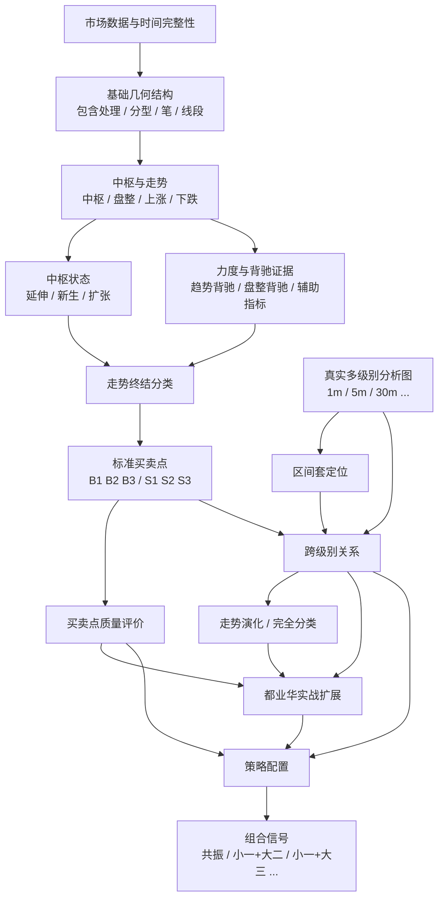

# 缠论分析引擎终局架构与理论边界

> 状态：目标架构（Target Architecture）  
> 日期：2026-08-08  
> 目的：定义项目长期结构、理论边界、证据关系和分阶段开发顺序。本文不是“当前已实现功能清单”，未明确标记为当前阶段的模块均只做架构预留，不应一次性开发。

---

## 1. 核心结论

本项目长期采用以下原则：

1. **结构事实、走势终结、买卖点身份、买点质量、跨级别关系、策略信号必须分层。**
2. **B1/B2/B3（以及 S1/S2/S3）始终是标准买卖点身份，不因为“强弱、递归、共振”而创造新的买点类型。**
3. **“小转大”不是第四类买点，而是走势终结方式之一；应与其他终结方式统一建模。**
4. **递归不是一个 `true/false` 的“确认开关”。**它至少包含：真实多级别结构、低级别对高级别买点的构成关系、区间套精确定位、以及小级别引发大级别转折等不同机制。
5. **共振、大小周期组合属于上层信号组合，不属于底层买点分类。**不建立“市场转折事件”作为底层核心实体；未来如有需要，可由已验证的买点与跨级别关系动态组合成 `CompositeSignal`。
6. **配置不改写历史事实。**配置只决定质量门槛和策略是否接受某个已经成立的买点；改变配置后，历史结构事实和买点身份不能被重写。
7. **当前开发必须循序渐进。**先把单级别结构、标准买卖点、质量事实和配置做准；真实递归、区间套、小转大、共振等只预留架构位置，等前一层经过真实行情验证后再实现。

---

## 2. 理论来源分层

项目中的每一条规则都应能归入以下三类来源之一，禁止混写。

### 2.1 `ORIGINAL_THEORY`：缠中说禅原著/定理

用于定义理论核心，例如：

- 走势终完美；
- 中枢、盘整、趋势；
- 三类买卖点的完备性；
- 第二类买点与低级别第一类买点的构成关系；
- 第三类买卖点；
- 背驰—转折关系；
- 区间套；
- 买卖点级别定理；
- 小背驰—大转折定理。

工程文档引用原著时以“课程编号/定理名称”为主键，网页仅作为原文镜像入口。

### 2.2 `DU_YEHUA_PRACTICE`：都业华实战体系

用于定义实战扩展和质量评价，例如：

- 走势终完美后的“四种终结方式”教学框架；
- B1/B2/B3 的强弱分层；
- R 比率；
- 分型停顿；
- 类二买；
- 分型重构买点；
- 大小周期组合；
- 区间套的实战使用；
- 黄金分割等辅助工具。

**重要：**公开可检索到的都业华资料大量来自课程目录和学员/二手整理，并非官方逐字稿。因此：

- 课程目录可用于确认“课程确实讨论过什么主题”；
- 二手笔记可用于形成候选规则；
- 涉及精确阈值、强弱定义和算法落地时，应尽量回到原课程视频再次核验；
- 都业华实战规则不得伪装成原著定理。

### 2.3 `PROJECT_POLICY`：本项目工程规则

用于解决理论落地时必须明确、但原著没有以软件规范描述的问题，例如：

- 正式结构与候选结构的生命周期；
- `confirmed_at` 的定义；
- 无未来函数；
- 数据身份与指纹；
- 同一信号的审计证据；
- 配置版本；
- 单级别 MVP 的运行边界。

---

## 3. 关键术语与边界

### 3.1 数据周期不等于理论级别

工程中必须区分：

- **Market Interval**：1m、5m、30m 等 K 线采样周期；
- **Chan Structure Level**：由走势、中枢及递归关系形成的缠论结构级别。

当前项目可以使用“5m 分析”“30m 分析”作为工程简称，但长期模型中不能把 `interval` 和 `structure_level` 永久绑定成同一个字段。

### 3.2 单级别分析

单级别模式只消费当前分析范围内的正式结构：

`当前周期 K 线 → 当前分析分型 → 笔 → 线段 → 线段中枢 → 当前级别买卖点`

**禁止：**把 5m 线段内部的笔称为“1m 次级别走势”，也禁止用这种伪次级别证据完成递归规则。

### 3.3 买卖点身份与质量是两回事

- **身份**回答：它是什么？例如 `5m B1`。
- **质量**回答：这个 B1 的本级结构有多强？
- **跨级别关系**回答：它与 1m、30m 的其他买点是什么关系？
- **策略配置**回答：当前策略是否接受它？

四者必须分别保存和计算。

---

## 4. 终局架构

这张图描述的是**终局边界**，不是开发顺序。

---

## 5. Layer 0：市场数据、时间完整性与证据追踪

这是所有上层结论的底座。

每个正式派生对象必须能够追溯：

- 数据源与标的；
- Market Interval；
- 起止时间；
- 真实可知时间 `confirmed_at`；
- 构成它的正式下层对象 ID/指纹；
- 算法版本；
- 如涉及配置评价，还要保存规则配置版本。

### 不可配置的工程不变量

以下规则不属于“策略偏好”，不能被配置关闭：

- 不允许未来数据；
- 未完成结构不能伪装成正式结构；
- 正式买卖点必须绑定正式证据；
- 缺少关键证据时 fail closed；
- 同级别模式不能把内部笔伪装成真实低级别走势；
- 跨级别关系必须绑定真实的两个分析级别；
- 历史结构事实不能因为策略配置变化而被改写。

---

## 6. Layer 1：基础几何结构

负责：

- K 线包含处理；
- 顶底分型；
- 笔；
- 线段；
- 线段终结与正式确认。

这一层只回答：**图形结构是什么。**

不得引入：

- 买卖点强弱；
- 共振；
- 策略过滤；
- 交易建议。

---

## 7. Layer 2：中枢、走势类型与中枢状态

负责：

- 中枢；
- 盘整；
- 上涨趋势；
- 下跌趋势；
- 中枢延伸；
- 新同级别中枢；
- 更大级别中枢扩张/形成。

原著基础：

- “任何级别的任何走势，都可以分解成同级别盘整、下跌与上涨三种走势类型的连接”；
- 盘整包含一个中枢；
- 趋势至少包含两个依次同向的同级别中枢；
- 中枢存在延伸、新生以及形成更大级别中枢的关系。

这一层回答：**当前走势是什么、处于什么结构状态。**

---

## 8. Layer 3：力度与背驰证据

背驰必须成为独立的证据层，而不是只写死在 B1 检测器内部。

至少需要区分：

- 趋势背驰；
- 盘整背驰；
- 背驰段；
- 价格新高/新低关系；
- 力度比较。

MACD 的定位是**辅助判断证据**，不是理论定义本身。原著《教你炒股票24》明确把 MACD 描述为对背驰的辅助判断方法，而非绝对精确定义。

都业华体系中的 R 比率、MACD 回零轴、面积比较等应进入本层的“实践质量证据”，但必须标记来源，不与原著结构定义混淆。

---

## 9. Layer 4：走势终结分类

终结方式与买卖点身份必须分开。

### 9.1 都业华“四种终结方式”框架

课程目录明确存在“走势终完美、四种终结方式”主题。公开课程笔记通常整理为：

1. **中枢背驰终结**；
2. **盘整背驰终结**；
3. **小转大终结**；
4. **中枢无背驰终结**。

其中“小转大”在原著中有直接理论依据：小级别背驰可能引发大级别转折，并存在“小背驰—大转折定理”。

### 9.2 架构要求

`TerminationMode` 是独立分类，不等于 B1/B2/B3：

- 中枢背驰不是“一买”的别名；
- 盘整背驰不是“二买”的别名；
- 小转大不是“第四类买点”；
- 中枢无背驰终结也不是“第四类买点”。

终结方式回答：**前一段走势如何结束。**  
买卖点回答：**当前操作位置是什么类型。**

### 9.3 实现边界

单级别阶段只能实现有足够单级别证据的终结判断。

**小转大必须等待真实多级别分析。**在没有真实低级别结构之前，禁止用当前级别内部笔去模拟“小级别背驰”。

终结分类应允许 `PENDING / UNKNOWN`，不能为了凑“四种完全分类”而在证据不足时强判。

---

## 10. Layer 5：标准三类买卖点

### 10.1 身份集合固定

理论核心始终只有：

- `B1 / B2 / B3`
- `S1 / S2 / S3`

原著《教你炒股票21》明确讨论三类买卖点的完备性。因此：

- 不创建 `B4`；
- 不创建 `RECURSIVE_B1`；
- 不创建 `STRONG_B1` 作为新的类型；
- 不把“类二买”冒充标准 B2。

### 10.2 当前项目的单级别默认口径

以下是当前项目的**工程操作口径**，用于单级别阶段；它与长期多级别理论证据分开保存。

#### B1

默认：

- 至少两个依次下降的同级别中枢形成下跌趋势；
- 最终离开段创新低；
- 出现趋势背驰。

“两中枢”与原著“趋势至少有两个依次同向中枢”的定义一致；更高的中枢数量属于质量增强，不应改变已经成立的 B1 身份。

#### B2

单级别操作定义：

- 已存在正式 B1；
- B1 后出现第一段上行；
- 随后的第一次回调不跌破 B1 低点。

长期真实多级别模式中，应额外建立原著定律所要求的跨级别关系：**大级别第二类买点由次一级别相应走势的第一类买点构成。**

这不是把单级别 B2 删除，而是给长期 canonical 多级别结果增加真实构成证据。

#### B3

标准关系：

- 走势向上离开某同级别中枢；
- 随后第一次反向回试；
- 回试低点不跌破 `ZG`。

第三类卖点镜像处理。

### 10.3 一个位置可以有多个身份

系统必须允许：

- 同一级别 B2 与 B3 同时成立；
- 同一时间/价格区域同时出现 1m B1、5m B2、30m B3。

不能强制“一个市场位置只能对应一个买点类型”。

---

## 11. Layer 6：买卖点质量与强度

质量层只评价已经识别出的买点，不改变身份。

### 11.1 保存原始质量事实，而不是只保存“强/弱”标签

例如 B1 应保存：

- 中枢数量；
- 背驰强度原始值；
- 是否存在额外末端盘背/衰竭证据；
- 是否存在分型停顿等实践证据。

B2 应保存：

- B1 后反弹最高到达哪里；
- 是否重新进入前下降中枢；
- 是否到达/突破前中枢 `ZG`；
- 回调最低点相对 B1、`ZD`、`ZG` 的位置；
- 是否与 B3 重合。

B3 应保存：

- 回试低点相对 `ZG` 的距离；
- 回试是否与中枢内部波动重叠；
- 离开段力度；
- 回试深度。

“普通 / 强 / 很强”只能是基于这些原始事实和某个 `QualityProfile` 动态推导的标签。

### 11.2 默认配置方向

当前优先设计的质量门槛：

- B1：策略最低接受的中枢数量默认 2；可提高到 3 等更严格要求；
- B1：是否要求末端额外盘背/更小结构衰竭作为增强条件；
- B2：反弹至少达到前下降中枢的哪个位置；
- B2：回调最低允许守住 B1 低点、`ZD` 或更严格边界；
- B3：标准身份以不重新进入 `ZG` 为底线；更强策略可以要求不与中枢内部任何波动重叠；
- 边界是否允许相等应作为明确规则，而不能散落在判断代码中。

### 11.3 配置改变的是“接受门槛”，不是历史事实

例：某个位置满足“两中枢趋势背驰 B1”。

- 配置要求 `min_accepted_zone_count = 2`：策略接受；
- 改为 `3`：策略拒绝；
- 但该位置仍然是一个“两中枢 B1”，历史结构事实不能被重写成“不是 B1”。

---

## 12. Layer 7：真实多级别分析图

真实递归的前提是：**每个级别都有自己的独立正式结构。**

例如：

- 1m `AnalysisSnapshot`；
- 5m `AnalysisSnapshot`；
- 30m `AnalysisSnapshot`。

每个分析对象独立拥有自己的：

- 分型；
- 笔；
- 线段；
- 中枢；
- 走势；
- 背驰；
- B1/B2/B3。

长期实现时建立 `MultiLevelAnalysisGraph` 将这些独立事实关联起来。

### 12.1 原著依据

原著“买卖点级别定理”指出：

> 大级别的买卖点必然是次级别以下某一级别的买卖点。

同时强调：不一定恰好是“直接次一级”，因此架构不能硬编码成 `30m -> 5m` 一跳关系；必须允许 `30m -> 1m` 等跨多级关系。

---

## 13. Layer 8：区间套精确定位

区间套与“建立多级别结构”不是同一件事。

- **真实多级别分析**：各级别结构客观存在；
- **区间套**：从已经识别出的高级别背驰/转折范围，向更低级别逐级缩小定位区间。

原著《教你炒股票27》给出“精确大转折点寻找程序”：通过不同级别背驰段逐级收缩范围确定大级别转折点；《教你炒股票29》进一步以 5 分钟背驰段通过 1 分钟及更低级别精确定位为例。

因此未来区间套应建模为：

`高级别候选转折范围 -> 低级别包含范围 -> 更低级别包含范围 -> 精确买卖点`

它不是：

`recursive_confirmation = true`

也不要求系统从全市场所有最小级别买点盲目向上猜高级别买点。

---

## 14. Layer 9：跨级别关系图

递归最终应表现为**关系图**，而不是给买点增加一个布尔字段。

底层至少预留以下关系：

### 14.1 `CONSTITUTES`：构成

典型理论关系：

`低一级 B1 -> 构成 -> 高一级 B2`

来源：原著买点定律。

### 14.2 `LOCATES`：定位

低级别背驰/买点把高级别背驰范围精确缩小到更具体的时间与价格区域。

来源：区间套。

### 14.3 `COINCIDES`：买点身份重合

例如同一区域：

- 1m B1；
- 5m B2；
- 5m B3。

这里不是创造“新买点”，而是多个已成立身份的重合。

### 14.4 小转大关系

小转大由低级别背驰与更高级别结构共同决定，应由真实跨级别证据生成 `TerminationMode.SMALL_TO_LARGE` 或等价终结事实。

原著“小背驰—大转折定理”给出了必要条件：小级别背驰引发大级别转折，需要相应次级别中枢出现第三类买卖点关系。

### 14.5 共振不是底层原子关系

“不同级别同步共振”有原著依据，但工程上应由多个买点事实及其时间/价格关系派生出来。

因此：

- 底层存事实和关系；
- 上层再计算“共振”。

---

## 15. Layer 10：走势演化与完全分类

终局系统不能只回答“这里有没有 B3”，还应能回答：

- 当前走势已经确认到什么状态；
- 下一步有哪些理论上合法的结构分支；
- 哪些分支已经被排除；
- 中枢是继续延伸、形成新中枢，还是扩张为更高级别中枢；
- 背驰后是中枢扩展、更大级别盘整还是更高级别反趋势。

原著“背驰—转折定理”明确给出趋势背驰后的三类结果：

1. 最后中枢级别扩展；
2. 更大级别盘整；
3. 更高级别反趋势。

工程上可以把这一层设计为 `MovementState / AllowedTransitions` 状态机，但这是**工程抽象**，不是原著原有名词。

此层是后期工程；当前不开发。

---

## 16. Layer 11：都业华实战扩展层

都业华课程目录显示，在基础结构、一二三买、走势终结之后，还继续讲授：

- 中枢重新定义及精确买点；
- 第三类买点后走势分类；
- 类二买；
- 分型重构买点；
- 区间套；
- R 比率；
- 黄金分割；
- 大小周期组合等。

这些属于 `Practice Layer`，不得反向污染原著核心类型。

例如：

- “类二买”不是 B4，也不能悄悄改写标准 B2；
- “分型重构买点”应作为独立实践模式或质量证据；
- R 比率、黄金分割更适合作为质量/交易过滤证据，而非改变 B1/B2/B3 的身份。

---

## 17. Layer 12：策略配置与组合信号

这是最上层。

### 17.1 配置分三类

#### A. `QualityProfile`：本级别质量门槛

例如：

- B1 至少接受几个中枢；
- 是否要求末端额外盘背；
- B2 反弹至少到前中枢什么位置；
- B2 回调最低守哪条边界；
- B3 只要求守 `ZG`，还是要求不与中枢内部任何波动重叠。

#### B. `LocalizationProfile`：递归/区间套精度

例如：

- 单级别即可；
- 必须向下定位一级；
- 必须逐级定位到 1m；
- 允许跨过直接次级别去绑定更低级别买点。

#### C. `SignalProfile`：跨级别组合策略

例如：

- 小一 + 大二；
- 小一 + 大三；
- 小一 + 大二三重合；
- 多级别 B1 同步；
- 某种走势终结方式 + 某种买点质量。

### 17.2 不建立“市场转折事件”作为底层实体

如果未来产品需要一个统一输出对象，可以使用：

`CompositeSignal`

它只是以下事实的组合视图：

- 已成立的各级别买卖点；
- 已成立的终结方式；
- 已验证的跨级别关系；
- 质量评价；
- 当前策略配置。

例如：

`1m B1 + 5m B2 + 5m B3 -> 小一 + 大二三组合信号`

该组合信号不能反向修改底层任何买卖点身份。

---

## 18. 配置架构的总原则

配置系统必须遵守：

### 18.1 不可配置：理论/正确性不变量

例如：

- 正式结构身份；
- 无未来函数；
- 三类标准买卖点集合；
- 第三类买点的中枢关系底线；
- 真实跨级别必须使用真实低级别结构；
- 证据缺失 fail closed。

### 18.2 可配置：质量与策略门槛

例如：

- B1 接受 2 个还是 3 个以上中枢；
- 是否要求额外末端盘背；
- B2 对反弹高度和回调深度的要求；
- B3 使用 `ZG` 作为标准门槛后，是否进一步要求高于中枢内部最高波动；
- 是否要求真实低级别构成/定位证据；
- 是否只接受某类共振组合。

### 18.3 每次评价必须可审计

最终结果至少能回答：

- 这个点为什么是 B1/B2/B3；
- 当时用了哪些结构证据；
- 它的原始质量事实是什么；
- 使用的是哪个质量配置版本；
- 是否存在低级别构成/定位关系；
- 为什么当前策略接受或拒绝它。

---

## 19. 推荐开发顺序

终局架构必须一次设计清楚，但实现必须分期。

### Phase 1：单级别核心买卖点与质量配置 —— 当前优先

只做：

- 已有基础结构正确性继续加固；
- 同级别中枢/趋势证据；
- B1/B2/B3、S1/S2/S3；
- 买点质量原始事实；
- `QualityProfile`；
- 审计证据与配置版本；
- 真实行情验证、前缀一致性、无重绘验证。

**不做：**真实递归、区间套、小转大、共振、完整走势状态机。

### Phase 2：单级别可判定的走势终结分类

补充：

- 趋势背驰终结；
- 盘整背驰相关事实；
- 中枢状态与终结证据；
- `TerminationMode` 数据模型。

小转大只预留枚举/接口，不在没有真实低级别证据时判定。

### Phase 3：真实多级别分析

实现：

- 独立 1m / 5m / 30m 等 `AnalysisSnapshot`；
- 级别之间的时间范围映射；
- 分析结果身份与版本绑定。

这一阶段先解决“不同级别都算对”，暂不急着做共振。

### Phase 4：区间套 + 小转大

在真实多级别结构可靠后：

- 高级别背驰段向下逐级定位；
- `LOCATES` 关系；
- 小背驰—大转折条件；
- 完成小转大终结模式。

### Phase 5：跨级别买点关系

实现：

- `CONSTITUTES`；
- `LOCATES`；
- `COINCIDES`；
- 多级别同步关系所需的基础事实。

### Phase 6：走势完全分类 / 演化状态机

实现：

- 中枢延伸/新生/扩张后的状态变化；
- 背驰后的合法演化分支；
- B3 后走势分类；
- 已确认/待确认/已排除分支。

### Phase 7：都业华实战扩展

逐项、逐证据实现：

- 类二买；
- 分型重构；
- R 比率；
- 黄金分割辅助；
- 其他课程实战规则。

每增加一项必须标明 `DU_YEHUA_PRACTICE` 来源并独立测试。

### Phase 8：共振与组合信号

最后实现：

- 小一 + 大二；
- 小一 + 大三；
- 小一 + 大二三；
- 多级别同步；
- 自定义 `SignalProfile`。

组合信号只消费底层事实，不重新计算或重定义底层结构。

---

## 20. 每次新增功能前的架构检查

任何新规则进入代码前，必须先回答它属于哪一类：

1. 基础结构事实？
2. 中枢/走势状态？
3. 力度/背驰证据？
4. 走势终结方式？
5. 标准 B1/B2/B3 身份？
6. 买点质量？
7. 跨级别构成或定位关系？
8. 都业华实践扩展？
9. 策略配置？
10. 上层组合信号？

如果无法明确归类，**不得直接写入买卖点检测器。**

---

## 21. 理论依据索引

### 21.1 缠中说禅原著/定理原文镜像

> 注：以下链接为公开原文镜像/整理站，架构引用以原著课程编号和定理名称为核心，而不是把镜像站视为理论作者。

1. **技术分析基本原理、中枢、走势分解、第二类买点构成关系**  
   《教你炒股票17：走势终完美》及定理整理：  
   https://iczsc.com/read/017/  
   https://iczsc.com/theorems/003/

2. **中枢延伸、同级别中枢关系、第三类买卖点**  
   《教你炒股票20：缠中说禅走势中枢级别扩张及第三类买卖点》：  
   https://iczsc.com/read/020/  
   定理整理：https://iczsc.com/theorems/005/

3. **三类买卖点完备性**  
   《教你炒股票21：缠中说禅买卖点分析的完备性》：  
   https://iczsc.com/read/021/

4. **MACD 是背驰辅助判断**  
   《教你炒股票24：MACD对背弛的辅助判断》：  
   https://iczsc.com/read/024/

5. **区间套 / 精确大转折点寻找程序**  
   《教你炒股票27》：  
   https://iczsc.com/read/027/

6. **背驰—转折定理及低级别精确定位**  
   《教你炒股票29：转折的力度与级别》：  
   https://iczsc.com/read/029/  
   定理整理：https://iczsc.com/theorems/009/

7. **买卖点级别定理**  
   《教你炒股票35》：  
   https://iczsc.com/read/035/  
   定理整理：https://iczsc.com/theorems/010/

8. **第二类买点由次一级别第一类买点构成**  
   定理整理：  
   https://iczsc.com/theorems/001/

9. **小背驰—大转折定理**  
   定理整理：  
   https://iczsc.com/theorems/012/

10. **背驰后的走势级别变化与走势分解补充**  
    《教你炒股票43：有关背驰的补习课》：  
    https://iczsc.com/read/043/

### 21.2 都业华课程结构与公开二手整理

1. **课程目录**：可确认课程依次覆盖分型、笔、线段、中枢、背驰与一买、走势完全分类、四种终结方式、二买、三买、中枢重新定义、三买后走势分类、类二买、分型重构、区间套等主题：  
   https://ke.iya88.com/34576.html  
   备用目录：https://www.5588.in/92397.html

2. **四种终结方式的公开二手整理**：常见整理为“中枢背驰、盘整背驰、小转大、中枢无背驰”。该来源不是官方逐字稿，只作为都业华实践层候选规则依据：  
   https://xueqiu.com/1613417401/173127314

### 21.3 理论引用规则

未来文档和代码注释引用这些规则时，建议使用：

- `ORIGINAL_THEORY: Lesson 21 / Trading Point Completeness`
- `ORIGINAL_THEORY: Lesson 27 / Interval Nesting`
- `DU_YEHUA_PRACTICE: Four Termination Modes`
- `PROJECT_POLICY: Single-Level Trading Point Profile v1`

不要只写“缠论规定”“都业华说”，必须能够追踪到来源类型和具体主题。

---

## 22. 当前项目边界

截至本文设计时，近期开发焦点只允许落在：

> **单级别正式结构 → 标准 B1/B2/B3 → 原始质量事实 → 可配置质量门槛 → 严格验证**

终局架构中的以下能力当前只做接口和概念预留：

- 完整四种终结方式；
- 真实多级别递归；
- 区间套；
- 小转大；
- 跨级别关系图；
- 走势完全分类状态机；
- 都业华后续扩展；
- 共振/组合信号。

**开发纪律：前一层没有通过真实数据与无未来函数验证，不进入下一层。**

---

## 23. 最终架构原则（一句话版）

> **结构是事实；终结方式解释走势如何结束；B1/B2/B3 是某一级别上的标准身份；强弱是质量评价；递归负责真实级别之间的构成与定位；共振是多级别事实的组合；配置只决定策略接受什么，绝不改写底层事实。**
