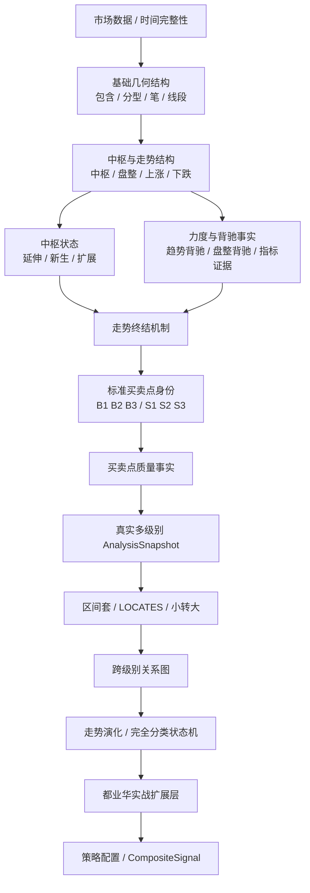

# 缠论分析引擎终局架构与理论边界

> 状态：目标架构（Target Architecture）  
> 日期：2026-08-08  
> 目的：定义项目长期结构、理论边界、证据关系和分阶段开发顺序。  
> 重要：本文不是当前已实现功能清单。除明确标记为当前阶段的内容外，其余模块只做架构预留，不应提前一次性开发。

---

## 1. 核心结论

本项目长期遵守以下原则：

1. **结构事实、走势终结、买卖点身份、买点质量、跨级别关系、策略选择必须分层。**
2. **B1/B2/B3（以及 S1/S2/S3）始终是标准买卖点身份。**“强弱、递归、共振、大小周期组合”都不能创造新的标准买卖点类型。
3. **买卖点识别器只回答“它是不是这个买卖点”，不读取强弱配置。**质量模块只计算事实，策略模块才读取配置。
4. **配置不改写历史事实。**一个已经成立的 2 中枢 B1，在策略改成“只接受 3 中枢 B1”以后，仍然是 B1，只是策略结果由 `ACCEPTED` 变为 `FILTERED`。
5. **“小转大”不是第四类买点。**它是走势终结机制之一，应和其他走势终结方式放在同一层，但只有在真实跨级别证据存在后才能判定。
6. **递归不是 `true/false` 的确认开关。**它涉及真实多级别结构、跨级别构成关系、区间套定位、小级别引发大级别转折等多种机制。
7. **区间套负责定位，不负责重新发明买点身份。**低级别可以精确定位、构成或与高级别买点重合，但各级别仍独立拥有自己的 B1/B2/B3 身份。
8. **共振、大小周期组合属于上层组合信号。**不建立“市场转折事件”作为底层核心实体；未来如需统一输出，可由底层事实动态生成 `CompositeSignal`。
9. **单级别可观测事实与跨级别必需证据必须显式区分。**禁止用当前周期内部的笔、线段或局部结构伪装真实低级别证据。
10. **终局架构一次设计清楚，开发必须分阶段。**前一层没有经过真实行情、前缀一致性和无未来函数验证，不进入下一层。

---

## 2. 理论来源分层

项目中的规则必须能归入以下三类来源之一，禁止混写。

### 2.1 `ORIGINAL_THEORY`：缠中说禅原著/定理

用于定义理论核心，例如：

- 走势终完美；
- 中枢、盘整、趋势；
- 中枢延伸、扩展、新生等结构关系；
- 三类买卖点及其完备性；
- 第二类买点与低级别第一类买点的构成关系；
- 第三类买卖点；
- 背驰—转折关系；
- 区间套；
- 买卖点级别关系；
- 小背驰—大转折关系。

工程文档引用原著时以“课程编号 / 定理主题”为主键，网页仅作为原文镜像入口。

### 2.2 `DU_YEHUA_PRACTICE`：都业华实战体系

用于定义实战扩展和质量评价，例如：

- “四种终结方式”的教学框架；
- B1/B2/B3 的强弱分层；
- R 比率；
- 分型停顿；
- 类二买；
- 分型重构买点；
- 区间套的实战使用；
- 大小周期组合；
- 黄金分割等辅助工具。

公开可检索的都业华资料中包含课程目录、公开视频和大量二手整理。因此：

- 课程目录可以确认课程主题；
- 二手笔记只能作为候选规则；
- 涉及精确阈值、强弱定义和算法落地时，应尽量回到原课程视频核验；
- 都业华实战规则不得伪装成原著定理。

### 2.3 `PROJECT_POLICY`：本项目工程规则

用于解决理论软件化必须明确、但原著没有以工程规范描述的问题，例如：

- 正式结构与候选结构生命周期；
- `confirmed_at`；
- 无未来函数；
- 数据身份、版本与指纹；
- 审计证据；
- 规则配置版本；
- 单级别 MVP 的运行边界；
- `ACCEPTED / FILTERED` 等策略决策状态。

---

## 3. 关键术语与边界

### 3.1 Market Interval 不等于 Chan Structure Level

工程中必须区分：

- **Market Interval**：1m、5m、30m 等 K 线采样周期；
- **Chan Structure Level**：由走势、中枢及递归关系形成的缠论结构级别。

当前项目可以使用“5m 分析”“30m 分析”作为工程简称，但长期模型中不能把 `interval` 与 `structure_level` 永久视为同一个概念。

### 3.2 单级别分析

单级别模式只消费当前分析范围内的正式结构：

```text
当前周期 K 线
→ 当前周期分型
→ 当前周期笔
→ 当前周期线段
→ 当前周期线段中枢
→ 当前单级别买卖点
```

**禁止：**

- 把 5m 线段内部的 5m 笔称作“1m 次级别走势”；
- 用同一周期内部结构模拟真实次级别盘背；
- 用伪次级别证据完成区间套、小转大或跨级别共振。

### 3.3 买卖点身份、质量、策略是三件不同的事

必须分成三个阶段：

```text
TradingPointDetector
        ↓
TradingPointIdentity
        ↓
QualityEvaluator
        ↓
QualityFacts
        ↓
StrategyFilter + Config
        ↓
ACCEPTED / FILTERED / WAITING_FOR_REQUIRED_EVIDENCE
```

#### TradingPoint Identity

回答：**它是什么？**

例如：

- 5m B1；
- 5m B2；
- 5m B3。

身份判断只能使用该买点的最低理论定义和工程正确性约束，不能读取“我要多强”的策略配置。

#### Quality Facts

回答：**它具有什么质量事实？**

例如：

- B1 中枢数量 = 2；
- B1 MACD 面积比 = 0.63；
- B2 反弹是否触及前中枢 ZG；
- B2 回调是否守住前中枢 ZD；
- B3 回调是否仅守住 ZG；
- B3 是否高于中枢内部最高波动；
- 是否存在真实低级别末端盘背。

质量模块不得把一个基础身份已经成立的 B2/B3 改成 `REJECTED`。

#### Strategy Decision

回答：**当前策略是否接受？**

例如：

- `ACCEPTED`：身份成立且满足当前配置；
- `FILTERED`：身份成立，但质量不满足当前配置；
- `WAITING_FOR_REQUIRED_EVIDENCE`：策略要求真实跨级别证据，但该证据尚未可用。

`REJECTED` 只表示“理论身份不成立”，不得表示“这个点不够强”。

---

## 4. 架构总图



这张图是终局依赖关系，不代表当前开发顺序一次完成全部模块。

---

## 5. Layer 1：市场数据与时间完整性

这一层只负责数据真实性和时间边界：

- K 线周期合法；
- open/close time 连续；
- 历史锚点可验证；
- 实时数据与回放数据使用相同时间语义；
- 任何正式结构都不得引用确认时刻之后的数据。

这是所有上层结构的硬前提。

---

## 6. Layer 2：基础几何结构

职责：

```text
K线
→ 包含处理
→ 分型
→ 笔
→ 线段
```

必须支持：

- 候选 / 正式结构分离；
- 正式结构提交时间；
- 结构身份指纹；
- 尾部可变、正式前缀稳定；
- 前缀一致性；
- 无未来函数。

这一层没有 B1/B2/B3，也没有策略参数。

---

## 7. Layer 3：中枢与走势

职责：从正式结构建立：

- 中枢；
- 盘整；
- 上涨；
- 下跌；
- 同级别走势关系。

这里必须为后续状态演化预留：

- 中枢延伸；
- 中枢新生；
- 中枢扩展 / 级别扩展。

### 7.1 一个关键语义：级别扩展 ≠ 新的更大级别盘整

未来状态机必须严格区分：

#### A. 最后中枢发生级别扩展

例如原 5m 趋势中的最后 5m 中枢扩展成更高级别中枢。

此时关键语义是：**原走势内部结构仍在演化，不能仅凭“级别变大”就认定原趋势已经结束并切换到一个新走势。**

#### B. 原趋势已经完成，随后形成更大级别盘整

这里“更大级别盘整”中的“更大级别”是指：**转折后新生成的盘整，其结构级别高于原趋势级别**，例如 5m 趋势背驰后形成 30m 盘整。

这属于：

```text
已完成的原趋势
+
后续新的更高级别盘整走势
```

#### C. 原趋势已经完成，随后形成反趋势

这是另一条独立演化路径。

这三种结构不得因为都出现“更高级别”而合并成同一种状态。

---

## 8. Layer 4：力度与背驰事实

背驰必须独立成事实层，而不是直接写死在某个策略过滤器里。

至少区分：

- 趋势背驰；
- 盘整背驰；
- 背驰段；
- 价格新极值；
- 力度比较；
- MACD 等辅助证据。

### 8.1 MACD 是证据，不是级别替代物

MACD 可以用于当前级别力度判断，但不能因为某个 MACD 形态像低级别背驰，就把它当作真实 1m/5m 递归证据。

### 8.2 原始指标事实与质量阈值分离

例如保存：

```text
entry_area = 100
exit_area = 63
ratio = 0.63
```

而不是直接只保存：

```text
strong_divergence = true
```

因为未来不同 `QualityProfile` 可能使用 0.8、0.7、0.5 等不同门槛。

---

## 9. Layer 5：走势终结机制

这一层回答：**一段走势如何结束或转入新的结构阶段？**

在都业华实践层中，常见“四种终结方式”整理为：

1. 中枢背驰；
2. 盘整背驰；
3. 小转大；
4. 中枢无背驰。

工程中应统一建模为 `TerminationMode` 或等价事实，但必须保留来源标签，避免把都业华实践分类误写成原著原生枚举。

### 9.1 小转大不是孤立特殊补丁

它属于终结机制分类中的一项，而不是：

- 第四类买点；
- B1/B2/B3 的额外子类型；
- 单独的一套信号系统。

### 9.2 小转大只有在真实跨级别数据存在后才能判定

Phase 2 可以先预留 `TerminationMode.SMALL_TO_LARGE` 的数据模型，但不得在单级别阶段通过内部笔、内部线段或 MACD 猜测出“小转大”。

真正判定必须等真实多级别结构与 Phase 4 跨级别证据完成。

---

## 10. Layer 6：标准买卖点身份

标准身份只保留：

```text
B1 / B2 / B3
S1 / S2 / S3
```

强一买、递归一买、共振一买、小一大二组合都不是新的标准买点类型。

### 10.1 B1 身份与质量

B1 的身份底线由趋势及趋势背驰决定。

当前单级别工程口径中，至少两个同级别中枢形成趋势是 B1 身份的一部分。

因此：

- 2 中枢趋势背驰：可以是 B1；
- 3 中枢趋势背驰：仍然是 B1，只是质量事实更强；
- 1 中枢后盘整背驰：不能仅通过策略配置改名为标准 B1。

所以配置可以写：

```text
策略只接受 zone_count >= 3 的 B1
```

但不能把 B1 理论身份改成：

```text
zone_count >= 3 才存在 B1
```

### 10.2 B2 身份与质量

B2 的基础身份与“一类点之后的回抽不破一类点极值”等结构关系有关。

而以下属于质量事实：

- 一买后的上涨是否重新进入前下降中枢；
- 是否到达前中枢上沿 ZG；
- 回调是否守住前中枢下沿 ZD；
- 是否进一步守住 ZG；
- 是否与 B3 同时成立。

因此：

```text
没有涨到 ZG
```

不能直接把一个基础 B2 标成 `REJECTED`；它只能导致某个“强 B2 策略”将其 `FILTERED`。

### 10.3 B3 身份与质量

基础 B3：离开中枢后第一次回试不重新进入中枢。

例如买三基础边界：

```text
pullback_low >= ZG
```

进一步的强度事实可以是：

- 回调是否高于中枢内部最高波动；
- 离开力度；
- 回抽幅度；
- 是否存在低级别买点构成。

因此：

```text
低点 >= ZG
但低点 < 中枢内部最高波动
```

仍然可以是基础 B3，只是不满足“强 B3”质量口径。

---

## 11. Layer 7：买卖点质量事实

质量层只生产事实，不做策略最终裁决。

建议每个质量事实至少包含：

- `metric_name`；
- `raw_value`；
- `evidence_scope`；
- `source_type`；
- `evidence_refs`；
- `computed_at`；
- `rule_version`。

### 11.1 `evidence_scope`

质量事实必须显式标注证据范围。

#### `SINGLE_LEVEL_OBSERVABLE`

当前单级别就能可靠计算，例如：

- B1 中枢数量；
- 当前级别 MACD 面积比；
- B2 反弹相对 ZD/ZG 的位置；
- B2 回调相对 B1/中枢边界的位置；
- B3 回调相对 ZG/中枢内部最高波动的位置。

#### `CROSS_LEVEL_REQUIRED`

必须等待真实低级别数据，例如：

- 5m B1 末端内部是否存在真实 1m 盘背；
- 5m B2 回调内部是否存在真实 1m B1；
- 区间套定位结果；
- 小转大；
- 多级别买点共振。

**任何 `CROSS_LEVEL_REQUIRED` 项，在 Phase 1 不允许通过同周期内部结构伪造。**

---

## 12. Layer 8：真实多级别 AnalysisSnapshot

未来每个真实分析层级独立计算：

```text
1m AnalysisSnapshot
5m AnalysisSnapshot
30m AnalysisSnapshot
...
```

每个 Snapshot 必须有自己的：

- 数据范围；
- interval；
- structure identity；
- 中枢；
- 走势；
- 背驰；
- 买卖点；
- 正式提交时间；
- 版本与指纹。

跨级别算法只能消费这些真实 Snapshot，不能消费“高级别内部笔”来替代低级别 Snapshot。

---

## 13. Layer 9A：区间套、定位与小转大

这一层在真实多级别结构可靠后实现。

### 13.1 区间套

流程是：

```text
高级别已经识别出背驰范围
→ 进入真实次级别寻找对应背驰范围
→ 继续向更低级别收缩
→ 得到更精确的时间 / 价格定位
```

它不是：

```text
从全市场所有最小级别买点开始
→ 盲目向上猜哪个最终会成为高级别买点
```

### 13.2 `LOCATES` 在 Phase 4 首次产生

`LOCATES` 的语义是：

```text
低级别背驰 / 买点
LOCATES
高级别背驰范围 / 买点位置
```

**Phase 4 必须完整实现 `LOCATES` 的生成、证据绑定和验证。**

Phase 5 不再第二次“实现 LOCATES”，而是把已经可靠存在的 `LOCATES` 纳入统一跨级别关系图。

### 13.3 小转大

小转大由：

- 低级别背驰；
- 高级别当前结构；
- 后续中枢 / 第三类买卖点等必要结构关系

共同决定。

它属于 `TerminationMode`，但它的 classifier 实现依赖本层真实跨级别证据。

---

## 14. Layer 9B：完整跨级别关系图

这一层不重新计算各级别买点，而是组织已经成立的事实之间的关系。

至少预留：

### 14.1 `CONSTITUTES`

构成关系。

典型理论关系：

```text
低一级 B1
→ CONSTITUTES →
高一级 B2
```

### 14.2 `LOCATES`

由 Phase 4 区间套模块生成，本层负责统一存储、查询、组合与审计。

### 14.3 `COINCIDES`

同一时间 / 价格区域存在多个已经独立成立的买点身份，例如：

```text
1m B1
5m B2
5m B3
```

这不是一个新买点，而是身份重合关系。

### 14.4 `SYNCHRONOUS_WITH`

用于表达多个级别买卖点在定义好的时间 / 结构窗口中同步出现。

这是工程关系名，上层可据此派生“共振”。

### 14.5 共振不是底层原子类型

工程上：

```text
多个买点事实
+
跨级别关系
+
时间 / 价格同步规则
→ CompositeSignal: Resonance
```

底层关系不能因为上层定义了“钻石共振”等策略名称而改变。

---

## 15. Layer 10：走势演化与完全分类状态机

终局系统不能只回答“这里有没有 B3”，还应回答：

- 当前走势已确认到什么状态；
- 后续理论上允许哪些结构分支；
- 哪些分支已经被排除；
- 中枢在延伸、新生还是扩展；
- 原趋势是否已经完成；
- 背驰后属于哪一种结构演化。

### 15.1 背驰后演化必须保留三种不同语义

状态机至少要能区分：

1. **最后中枢级别扩展**：原走势内部继续演化；
2. **原趋势完成 → 更大级别盘整**：后续新盘整的结构级别高于原趋势级别；
3. **原趋势完成 → 反趋势**：产生新的反向趋势走势。

“更大级别盘整”中的“更大级别”是级别提升，不是“价格区间更宽”或“持续时间更长”的俗称。

此层是后期工程，当前不开发。

---

## 16. Layer 11：都业华实战扩展层

在标准结构、走势终结、买卖点和跨级别关系稳定后，再逐项加入：

- B1/B2/B3 强弱体系；
- 类二买；
- 分型重构买点；
- R 比率；
- 黄金分割；
- 分型停顿；
- 三买后走势分类；
- 大小周期组合；
- 其他课程实战规则。

### 16.1 实战扩展不能反向污染标准身份

例如：

- “类二买”不是 B4；
- “分型重构买点”不允许偷偷改写标准 B1/B2/B3；
- R 比率、黄金分割是质量 / 交易过滤证据，不是标准身份定义；
- “小一 + 大三”是组合模式，不是新的 `TradingPointType`。

---

## 17. Layer 12：配置与组合信号

这是最上层。

### 17.1 `QualityProfile`

控制“已经成立的买卖点至少要多强，策略才接受”。

例如：

- B1：基础身份至少 2 中枢；策略只接受 `zone_count >= 2` 或 `>= 3`；
- B1：是否要求更强的 MACD 背驰比；
- B1：是否要求真实低级别末端盘背；
- B2：反弹至少达到前中枢什么位置；
- B2：回调最低守住 B1、ZD 还是 ZG；
- B3：基础守 ZG；策略是否进一步要求不与中枢内部任何波动重叠。

**`QualityProfile` 不得传入 TradingPointDetector 改变标准身份。**

### 17.2 `LocalizationProfile`

控制策略要求的定位精度，例如：

- 单级别定位即可；
- 必须向下定位一级；
- 必须区间套到 1m；
- 允许跨过直接次级别绑定更低级别定位结果。

这同样是策略门槛，不改变高级别买点是否客观成立。

### 17.3 `SignalProfile`

控制上层组合，例如：

- 小一 + 大二；
- 小一 + 大三；
- 小一 + 大二三；
- 多级别 B1 同步；
- 某种终结方式 + 某种质量组合。

### 17.4 不建立“市场转折事件”作为底层实体

如果未来需要统一输出，可使用：

```text
CompositeSignal
```

它只是以下事实的组合视图：

- 已成立买卖点；
- 已成立终结方式；
- 已验证跨级别关系；
- 质量事实；
- 当前策略配置。

例如：

```text
1m B1 + 5m B2 + 5m B3
→ CompositeSignal: 小一 + 大二三
```

CompositeSignal 绝不能反向修改底层买卖点身份。

---

## 18. 配置系统硬约束

### 18.1 不可配置：理论身份与工程正确性不变量

例如：

- 正式结构身份；
- 无未来函数；
- 正式提交时间；
- 标准买卖点类型集合；
- B1 的最低趋势身份条件；
- B3 的基本中枢关系；
- 真实跨级别必须使用真实低级别 Snapshot；
- 缺关键证据 fail closed。

### 18.2 可配置：质量与策略门槛

例如：

- 只接受 2 中枢还是 3 中枢以上的 B1；
- MACD 背驰比要求；
- 是否要求真实低级别末端盘背；
- B2 反弹高度和回调深度；
- B3 是接受基础守 ZG，还是只接受“不与中枢内部任一波动重叠”的强三买；
- 是否要求区间套定位；
- 是否只接受特定跨级别组合。

### 18.3 禁止的实现方式

禁止：

```text
TradingPointDetector(config)
```

然后因为“策略要求更强”把基础买点改成 `REJECTED`。

推荐：

```text
identity = TradingPointDetector(structure)
quality  = QualityEvaluator(identity, structure, cross_level_evidence?)
decision = StrategyFilter(identity, quality, config)
```

### 18.4 每次评价必须可审计

最终至少能回答：

- 为什么它是 B1/B2/B3；
- 使用哪些结构证据确定身份；
- 原始质量事实是什么；
- 哪些质量事实是单级别可观测；
- 哪些事实必须依赖真实跨级别数据；
- 使用哪个配置版本；
- 当前策略为什么 `ACCEPTED`、`FILTERED` 或等待证据。

---

## 19. 推荐开发顺序

终局架构一次设计清楚，但实现严格分期。

### Phase 1：单级别标准买卖点 + 质量事实 + 配置过滤 —— 当前优先

只做：

- 继续加固基础结构正确性；
- 同级别中枢 / 趋势 / 背驰证据；
- B1/B2/B3、S1/S2/S3 基础身份；
- `SINGLE_LEVEL_OBSERVABLE` 质量事实；
- `QualityProfile`；
- `StrategyFilter`；
- 审计证据与配置版本；
- 真实行情验证；
- 前缀一致性；
- 无重绘验证。

**明确不做：**

- 真实递归；
- 区间套；
- 小转大；
- 真实低级别末端盘背；
- 多级别共振；
- 完整走势状态机。

### Phase 2：单级别可判定的走势终结与中枢状态

实现：

- 中枢状态事实；
- 趋势背驰终结；
- 盘整背驰相关事实；
- 单级别能可靠判断的终结证据；
- `TerminationMode` 数据模型。

`SMALL_TO_LARGE` 只预留枚举 / 接口，不在此阶段生成正式事实。

### Phase 3：真实多级别 AnalysisSnapshot

实现：

- 独立 1m / 5m / 30m 等 Snapshot；
- 时间范围映射；
- 级别间数据身份、版本、指纹绑定；
- 各级别先独立算对。

此阶段暂不急于做共振或区间套。

### Phase 4：区间套 + `LOCATES` + 小转大

在真实多级别结构可靠后：

- 高级别背驰段逐级向下定位；
- 正式生成和验证 `LOCATES`；
- 小背驰—大转折所需跨级别证据；
- 正式实现 `TerminationMode.SMALL_TO_LARGE` classifier。

**Phase 4 是 `LOCATES` 的首次实现阶段。**

### Phase 5：完整跨级别关系图

把已经存在的 `LOCATES` 纳入统一关系图，并新增：

- `CONSTITUTES`；
- `COINCIDES`；
- `SYNCHRONOUS_WITH` 所需基础事实；
- 关系查询、组合、审计、版本绑定。

**Phase 5 不重复实现 `LOCATES` 算法。**

### Phase 6：走势完全分类 / 演化状态机

实现：

- 中枢延伸 / 新生 / 扩展后的状态变化；
- 原走势是否完成；
- 背驰后的合法演化分支；
- “最后中枢扩展”与“新生成更大级别盘整”的严格区分；
- B3 后走势分类；
- 已确认 / 待确认 / 已排除分支。

### Phase 7：都业华实战扩展

逐项、逐证据实现：

- 类二买；
- 分型重构；
- R 比率；
- 黄金分割；
- 分型停顿；
- 其他课程实战规则。

每项必须标明来源与 `evidence_scope`，并独立测试。

### Phase 8：共振与组合信号

最后实现：

- 小一 + 大二；
- 小一 + 大三；
- 小一 + 大二三；
- 多级别同步；
- 自定义 `SignalProfile`；
- `CompositeSignal`。

组合信号只消费底层事实，不重新计算或重新定义底层结构。

---

## 20. 每次新增功能前的架构检查

任何新规则进入代码前，必须回答：

1. 它是基础结构事实吗？
2. 它是中枢 / 走势状态吗？
3. 它是力度 / 背驰事实吗？
4. 它是走势终结机制吗？
5. 它是标准 B1/B2/B3 身份条件吗？
6. 它只是买点质量事实吗？
7. 它是 `SINGLE_LEVEL_OBSERVABLE` 还是 `CROSS_LEVEL_REQUIRED`？
8. 它属于跨级别构成 / 定位 / 重合关系吗？
9. 它属于都业华实践扩展吗？
10. 它只是策略过滤条件吗？
11. 它只是上层组合信号吗？

如果无法明确归类，**不得直接写进 TradingPointDetector。**

---

## 21. 理论依据索引

### 21.1 缠中说禅原著 / 定理镜像

> 注：以下链接为公开原文镜像 / 整理站。架构引用以原著课程编号和定理主题为核心，不把镜像站视为理论作者。

1. **中枢、盘整、趋势、走势终完美及第二类买点相关基础**  
   《教你炒股票17：走势终完美》：  
   https://iczsc.com/read/017/  
   定理整理：https://iczsc.com/theorems/003/

2. **中枢延伸、级别扩展、第三类买卖点**  
   《教你炒股票20：缠中说禅走势中枢级别扩张及第三类买卖点》：  
   https://iczsc.com/read/020/  
   定理整理：https://iczsc.com/theorems/005/

3. **三类买卖点完备性、B2/B3 位置与后续意义**  
   《教你炒股票21：缠中说禅买卖点分析的完备性》：  
   https://iczsc.com/read/021/

4. **MACD 对背驰的辅助判断**  
   《教你炒股票24》：  
   https://iczsc.com/read/024/

5. **区间套 / 精确大转折点寻找程序**  
   《教你炒股票27》：  
   https://iczsc.com/read/027/

6. **背驰—转折、背驰后的级别演化、低级别精确定位**  
   《教你炒股票29：转折的力度与级别》：  
   https://iczsc.com/read/029/  
   定理整理：https://iczsc.com/theorems/009/

7. **买卖点级别关系**  
   《教你炒股票35》：  
   https://iczsc.com/read/035/  
   定理整理：https://iczsc.com/theorems/010/

8. **第二类买点由次一级别第一类买点构成**  
   定理整理：https://iczsc.com/theorems/001/

9. **小背驰—大转折**  
   定理整理：https://iczsc.com/theorems/012/

10. **背驰相关补充**  
    《教你炒股票43》：  
    https://iczsc.com/read/043/

### 21.2 都业华课程与公开整理

课程目录与公开材料显示，其体系在基础结构、一二三买之后继续覆盖：

- 走势完全分类；
- 四种终结方式；
- 二买 / 三买强弱；
- 中枢重新定义与精确买点；
- 三买后走势分类；
- 类二买；
- 分型重构；
- 区间套；
- R 比率；
- 大小周期组合等。

公开二手资料只能作为 `DU_YEHUA_PRACTICE` 候选依据，具体算法阈值必须继续核验原课程。

### 21.3 来源标注规则

建议规则表、测试说明和关键注释使用类似：

```text
ORIGINAL_THEORY: Lesson 21 / Trading Point Completeness
ORIGINAL_THEORY: Lesson 27 / Interval Nesting
DU_YEHUA_PRACTICE: Four Termination Modes
PROJECT_POLICY: Single-Level Trading Point Identity v1
PROJECT_POLICY: QualityProfile v1
```

来源标签是审计元数据，不要求机械地散落到每一行代码，但任何关键规则必须能够追溯。

---

## 22. 当前项目边界与迁移原则

截至本文设计时，近期开发焦点只允许落在：

```text
单级别正式结构
→ 标准 B1/B2/B3 身份
→ 单级别质量事实
→ 可配置策略过滤
→ 严格验证
```

终局架构中的以下能力当前只做概念 / 接口预留：

- 完整四种终结方式；
- 真实多级别递归；
- 区间套；
- 小转大；
- 真实低级别末端盘背；
- 完整跨级别关系图；
- 走势完全分类状态机；
- 都业华后续实践扩展；
- 共振 / 组合信号。

### 22.1 当前代码迁移时必须遵守的方向

后续实现必须逐步收敛到：

```text
Detector 不读 QualityProfile
QualityEvaluator 不改变 TradingPointIdentity
StrategyFilter 不修改历史结构事实
Cross-Level 规则只消费真实低级别 Snapshot
```

即使当前历史代码中还存在旧实现，也不得因为兼容旧代码而反向修改本架构原则。

### 22.2 开发纪律

**前一层没有通过真实数据、无未来函数、前缀一致性和审计验证，不进入下一层。**

---

## 23. 最终架构原则（一句话版）

> **结构是事实；终结方式解释走势如何结束；B1/B2/B3 是某一级别上的标准身份；强弱是独立质量事实；配置只过滤策略，不重定义买点；递归负责真实级别之间的构成与定位；区间套产生定位关系；共振是多级别事实的上层组合；所有跨级别证据必须来自真实低级别结构。**
